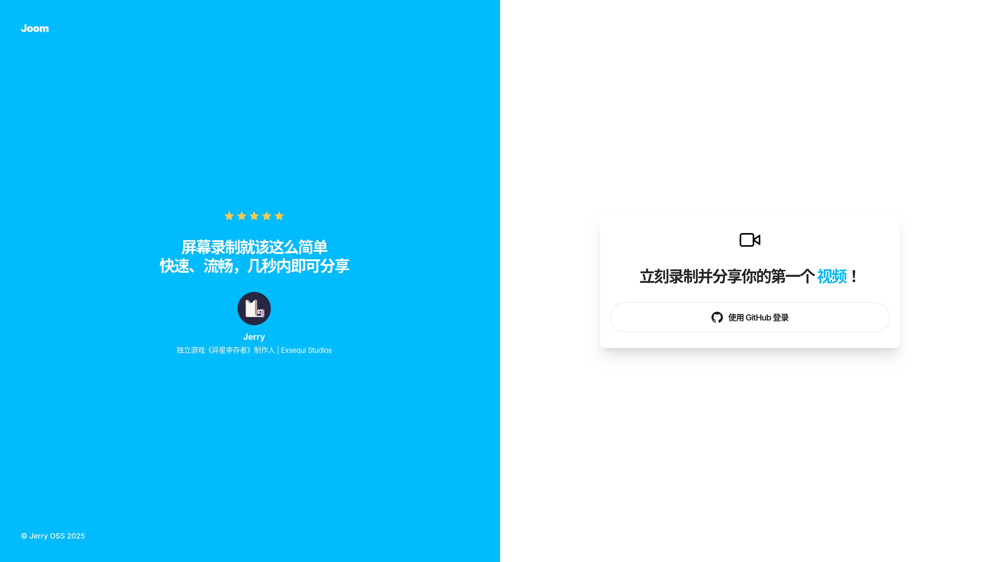
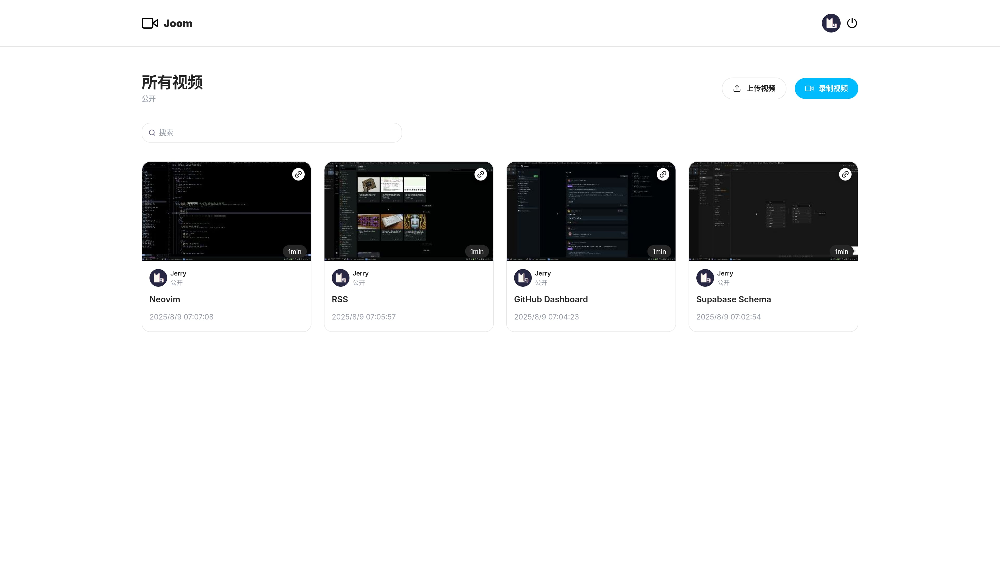
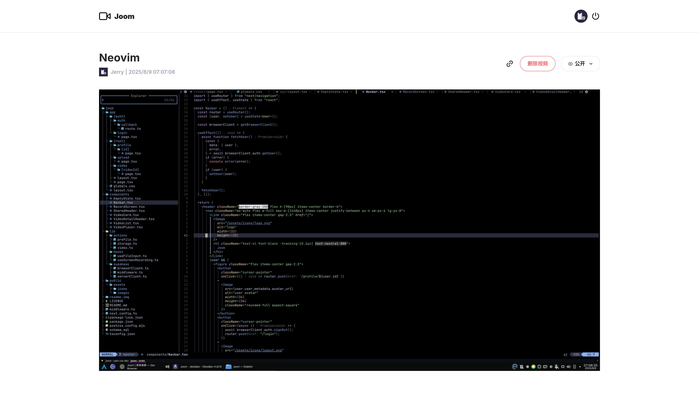

# Joom 简单录屏

_Joom_ 是一个开源、免费、自托管的屏幕录制和共享平台，无需安装即可使用浏览器轻松录制、上传和共享视频。

## 在线试用

<https://joom-theta.vercel.app>

_Demo 实例受成本限制，目前无法稳定提供服务。如果这个项目对你有价值，欢迎[为我充电](https://space.bilibili.com/281356255)！_

## 平台功能

- 用户认证：使用 GitHub OAuth 进行用户注册和登录
- 屏幕录制：直接在网页进行捕获屏幕，无须安装任何软件，实现无缝视频录制
- 视频上传：通过简洁的界面轻松上传视频，支持公开和私密设置
- 隐私控制：在公开和私密之间切换视频可见性，确保用户对内容完全掌控
- 搜索功能：通过直观的搜索栏快速找到视频，简化导航
- 分享视频：通过独特的链接分享视频，方便访问和分发
- 现代化 UI/UX：使用 Tailwind CSS 构建，简洁、响应式设计，提供流畅的用户体验
- 生产就绪：使用 Next.js 构建，实现快速、生产就绪的 Web 应用，可无缝扩展
- 跨设备兼容性：完全响应式设计，可在所有设备上无缝访问

## 技术栈

- React
- Next.js
- Tailwind CSS
- TypeScript
- Supabase

## 快速开始

按照以下步骤在本地机器上设置项目：

### 克隆代码仓库

```bash
git clone https://github.com/jerryshell/joom.git
cd joom
```

### 安装项目依赖

```bash
npm install
```

### 设置环境变量

在项目根目录下创建一个 `.env.local` 文件，并添加以下内容：

```env
NEXT_PUBLIC_SUPABASE_URL=""
NEXT_PUBLIC_SUPABASE_ANON_KEY=""
SUPABASE_SERVICE_ROLE_KEY=""
```

将值替换为实际的 Supabase 凭证，可以通过在 [Supabase](https://supabase.com) 注册并创建新项目来获取这些凭证。

具体的 Supabase 数据库表配置请参考项目的 [schema.sql](schema.sql) 文件。

_Supabase 是一个开源的后端基础设施，可以使用自己的服务器进行自托管所以不用担心 [供应商锁定](https://www.cloudflare-cn.com/learning/cloud/what-is-vendor-lock-in/) 的问题。_

### 运行项目

```bash
npm run dev
```

在浏览器中打开 <http://localhost:3000> 查看项目。

## 项目截图







## 开源协议

[GNU Affero General Public License v3.0](LICENSE)
